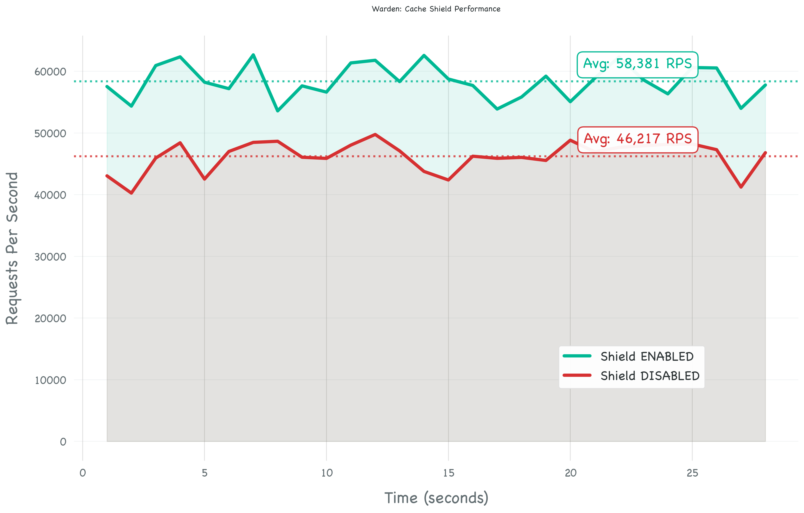
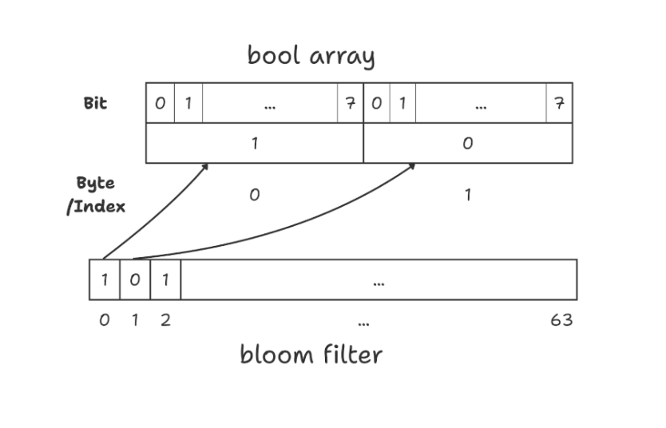
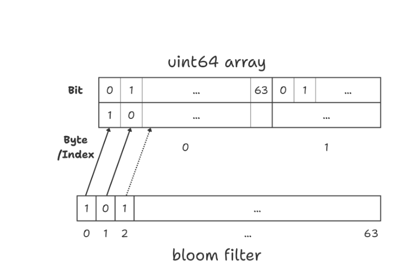

# Warden 🛡️

A simple demonstration of how **Bloom Filters** can protect your database from unnecessary load.

This project was built alongside a blog post exploring probabilistic data structures. It's a hands-on way to see the theory in action.

---

## What Problem Does This Solve?

Imagine you have a database with 1 million user records. Someone sends a request asking: "Does user `abc123` exist?"

If that user doesn't exist, your database still has to do work — it checks the index, maybe hits the disk, and finally returns "No."

Now imagine thousands of these requests per second, all asking for IDs that don't exist. Your database is spending all its time saying "No" instead of serving real users.

This is called **Cache Penetration**, and it's a common problem in high-traffic systems.

---

## The Idea

What if we could answer "No" without ever touching the database?

That's exactly what a **Bloom Filter** does. It's a simple data structure that can tell you:

- **"Definitely not here"** — You can trust this 100%. No need to check the database.
- **"Might be here"** — There's a small chance of error, so we check the database to confirm.

The key insight is that false negatives never happen. If the filter says "No", it means no.

---

## How Warden Works

1. On startup, the server loads all 1 million user IDs into a Bloom Filter in memory.
2. When a request comes in for `/check?id=xyz`, the filter is checked first.
3. If the filter says "No", we return `404` immediately — no database query needed.
4. If the filter says "Maybe", we query the database to get the real answer.

```go
// The check is simple
if !filter.Contains([]byte(id)) {
    // The filter is certain this ID doesn't exist
    http.Error(w, "Not found", http.StatusNotFound)
    return
}

// The filter said "maybe", so we confirm with the database
exists, _ := store.Check(id)
```

---

## Results

We ran a stress test with 160 concurrent workers sending a mix of valid and invalid requests.



| Mode | Requests/Second | Notes |
|------|-----------------|-------|
| Shield OFF | ~46,000 | Every request queries the database |
| Shield ON | ~58,000 | Invalid requests are filtered in memory |

That's a **26% improvement** in throughput, just by adding a simple in-memory check.

---

## Getting Started

### Build

```bash
go build -o server cmd/server/main.go
go build -o loadgen cmd/loadgen/main.go
```

### Run the Server

```bash
./server
```

The first run will create a SQLite database and seed it with 1 million users. Then it loads all IDs into the Bloom Filter.

```
Connecting to db...
DB ready! seeding took 6.2s
Bloom filter loaded! (1000000 items in 410ms)
Warden is active on :8080/check?id=...
```

### Run the Benchmark

To see the performance difference, we run two separate tests and compare the results.

#### 1. Test Shield OFF (Direct DB access)
```bash
# Disable the filter
curl http://localhost:8080/admin/shield/off

# Run load generator
./loadgen shield_off.csv
```

#### 2. Test Shield ON (Bloom Filter active)
```bash
# Enable the filter
curl http://localhost:8080/admin/shield/on

# Run load generator
./loadgen shield_on.csv
```

This starts 160 workers that continuously send requests — 50% for valid IDs and 50% for random non-existent IDs. You can watch the RPS in real-time in your terminal.

---

## A Note on Memory Efficiency

A Bloom Filter is essentially a large array of bits. The straightforward approach in Go would be to use a `[]bool` slice, but there's a catch.

In Go, each `bool` takes up 1 byte (8 bits), even though it only represents a single bit. For a filter with 10 million bits, that's 10 MB of memory for what should be 1.25 MB.

To fix this, we use a `[]uint64` array instead. Each `uint64` holds 64 bits, so we can pack them tightly with no wasted space.



*With `[]bool`, each bit uses a full byte. Wasteful.*



*With `[]uint64`, we pack 64 bits per element. 8x more efficient.*

The code to set and check bits is straightforward:

```go
// Setting a bit
index := bitPosition / 64
offset := bitPosition % 64
bitset[index] |= (1 << offset)

// Checking a bit
isSet := (bitset[index] & (1 << offset)) != 0
```

---

## Project Layout

```
warden/
├── cmd/
│   ├── server/main.go     # HTTP server with the shield
│   └── loadgen/main.go    # Load testing tool
├── internal/
├── imgs/                  # Benchmark and technical diagrams
└── README.md
```

### The Bloom Filter (`internal/bloom`)

- Uses double hashing with FNV-64a to generate multiple hash positions from a single input.
- The array size and number of hash functions are calculated using standard formulas to achieve a ~1% false positive rate.
- For 1 million items, this works out to about 9.6 million bits and 7 hash functions.

### The Load Generator (`cmd/loadgen`)

- Creates many concurrent workers to stress the server.
- Uses HTTP keep-alive connections to avoid connection overhead.
- Scales automatically based on your CPU cores (`GOMAXPROCS * 20`).

---

## Learn More

This project accompanies a blog post that goes deeper into Bloom Filter theory, the math behind sizing, and real-world use cases in systems like Cassandra and Bigtable.

